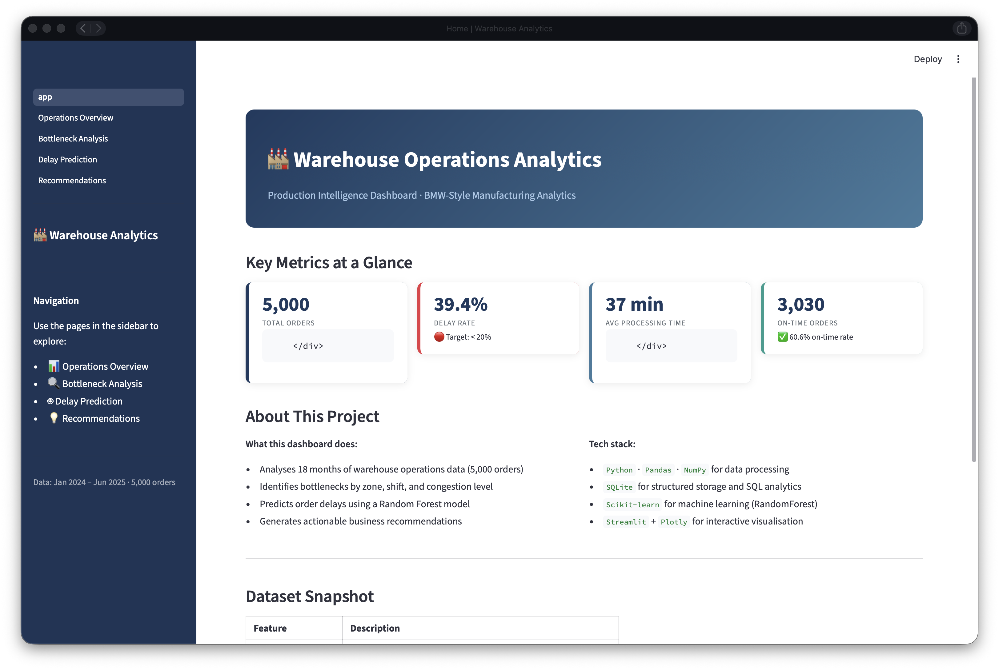
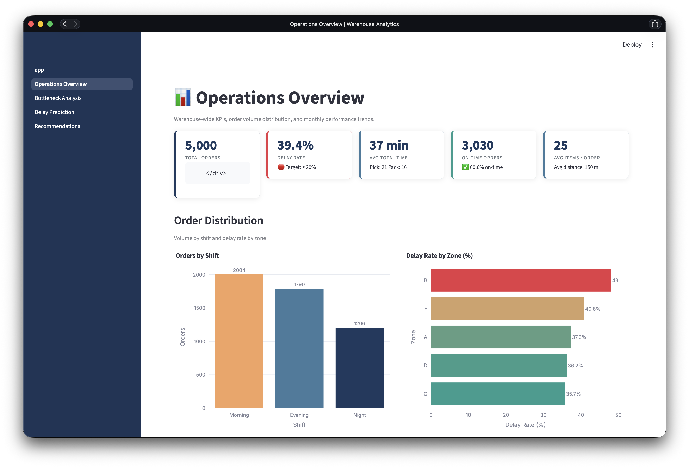
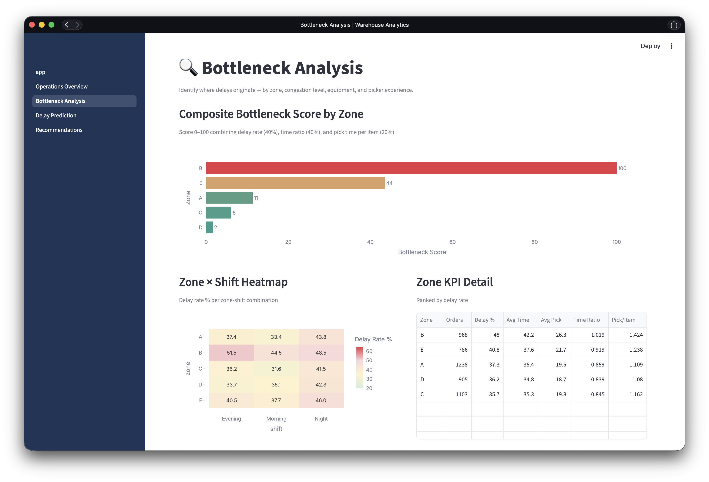
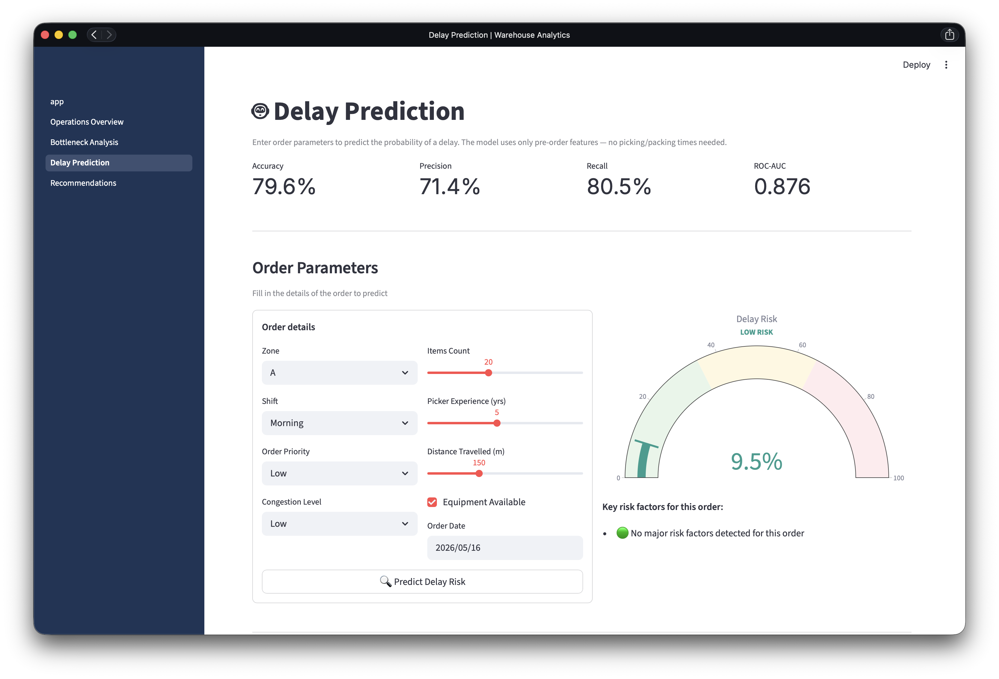
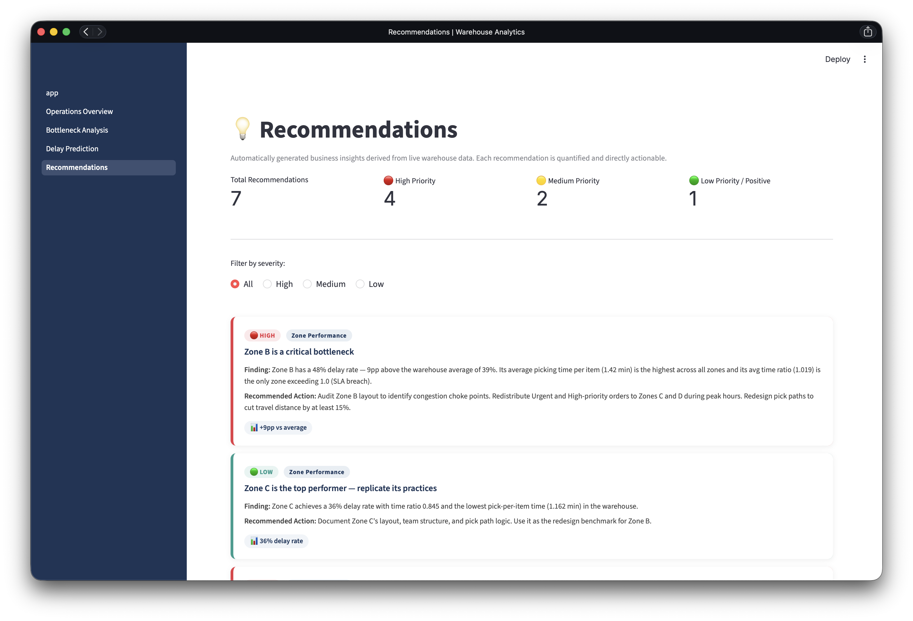

# 🏭 Warehouse Operations Analytics & Optimisation


A production-level warehouse analytics system that identifies operational bottlenecks, predicts order delays with machine learning, and generates quantified business recommendations — built to demonstrate the full data engineering and analytics stack required for manufacturing operations roles.

---

## Overview

This project simulates 18 months of warehouse operations data (5,000 orders) and delivers:

- **SQL-driven KPI engine** — 12 analysis functions querying a structured SQLite database
- **Bottleneck detection** — composite scoring across zones, shifts, congestion, and equipment
- **ML delay prediction** — RandomForest classifier (ROC-AUC: 0.876, Accuracy: 79.6%)
- **Automated recommendations** — 7 data-driven business insights with quantified impact
- **4-page Streamlit dashboard** — interactive, production-quality visualisations

---

## Key Findings

| Finding | Metric |
|---|---|
| Zone B (bottleneck) vs warehouse average | **+9pp delay rate**, only zone exceeding SLA (time ratio 1.02) |
| High vs Low congestion | **1.44× pick time**, 1.37× delay probability |
| Junior (1–3 yrs) vs Senior pickers (7–10 yrs) | **+20pp delay rate**, 58% slower per item |
| Night vs Morning shift | **+8pp delay rate** with similar avg experience |
| Urgent order SLA compliance | **64.8% breach rate** (28-min target) |
| Equipment downtime impact | **1.32× packing time**, affects 19% of orders |

---

## Dashboard

Four interactive pages built with Streamlit + Plotly:

| Page | Contents |
|---|---|
| **Operations Overview** | KPI cards, order volume by shift, delay rate by zone, monthly trend, priority SLA |
| **Bottleneck Analysis** | Composite bottleneck scores, zone × shift heatmap, congestion impact, experience curve |
| **Delay Prediction** | Live ML inference form, risk gauge, feature importance, confusion matrix |
| **Recommendations** | 7 severity-filtered business insights with findings, actions, and quantified metrics |

### Screenshots











---

## Machine Learning

**Model:** RandomForest Classifier (200 trees, balanced class weights)

**Design principle:** trained exclusively on pre-order features — no picking or packing times — to ensure the model is genuinely predictive, not retrospective.

| Metric | Score |
|---|---|
| Accuracy | 79.6% |
| Precision | 71.4% |
| Recall | 80.5% |
| F1 | 75.7% |
| ROC-AUC | **0.876** |

**Top predictive features:** workload index, items count, order priority, SLA target time, picker experience.

---

## Project Structure

```
warehouse-operations-analytics/
│
├── src/
│   ├── generate_data.py       # Synthetic dataset generation (5,000 orders, 18 months)
│   ├── preprocess.py          # Cleaning, feature engineering, SQLite ingestion
│   ├── analysis.py            # 12 SQL-driven KPI and bottleneck functions
│   ├── ml_model.py            # RandomForest training, evaluation, persistence
│   └── recommendations.py     # Automated insight generation from live data
│
├── dashboard/
│   ├── app.py                 # Home page
│   ├── utils.py               # Shared loaders, CSS, colour palette
│   └── pages/
│       ├── 1_Operations_Overview.py
│       ├── 2_Bottleneck_Analysis.py
│       ├── 3_Delay_Prediction.py
│       └── 4_Recommendations.py
│
├── data/
│   ├── warehouse_orders.csv          # Raw generated dataset
│   ├── warehouse_orders_clean.csv    # Enriched dataset (26 features)
│   └── warehouse.db                  # SQLite database (orders + ml_features tables)
│
└── models/
    └── model_metadata.json    # Accuracy, confusion matrix, feature importance
```

---

## Tech Stack

| Layer | Tools |
|---|---|
| Data generation & processing | Python, NumPy, Pandas |
| Database | SQLite (via `sqlite3` + `pandas.read_sql`) |
| Machine learning | Scikit-learn (RandomForest, train/test split, metrics) |
| Visualisation | Plotly Express, Plotly Graph Objects |
| Dashboard | Streamlit (multi-page, `@st.cache_data`, `@st.cache_resource`) |
| Model persistence | Joblib |

---

## Setup

**Prerequisites:** Python 3.12+

```bash
# Clone and enter the project
git clone https://github.com/SepehrKalantariSol/warehouse-operations-analytics.git
cd warehouse-operations-analytics

# Create virtual environment
python3 -m venv .venv
source .venv/bin/activate          # Windows: .venv\Scripts\activate

# Install dependencies
pip install -r requirements.txt

# Run the full pipeline
python src/generate_data.py        # 1. Generate dataset
python src/preprocess.py           # 2. Clean + load into SQLite
python src/ml_model.py             # 3. Train and save the ML model

# Launch the dashboard
streamlit run dashboard/app.py
```

Open [http://localhost:8501](http://localhost:8501) in your browser.

---

## Dataset Schema

| Column | Type | Description |
|---|---|---|
| `order_id` | TEXT | Unique order identifier |
| `order_date` | DATETIME | Order timestamp (Jan 2024 – Jun 2025) |
| `shift` | TEXT | Morning / Evening / Night |
| `zone` | TEXT | Warehouse zone (A–E) |
| `order_priority` | TEXT | Low / Medium / High / Urgent |
| `items_count` | INT | Number of items in the order |
| `picker_experience` | INT | Picker's years of experience (1–10) |
| `distance_travelled` | FLOAT | Estimated pick path distance (metres) |
| `congestion_level` | TEXT | Low / Medium / High |
| `equipment_available` | BOOL | Whether handling equipment was available |
| `picking_time` | FLOAT | Time to pick all items (minutes) |
| `packing_time` | FLOAT | Time to pack the order (minutes) |
| `total_time` | FLOAT | picking + packing time |
| `target_time` | INT | SLA target in minutes (by priority) |
| `delayed` | INT | **Target variable** — 1 if total_time > target_time |

---

## Business Context

This project is modelled on the analytics requirements of production steering and logistics optimisation roles in manufacturing environments (e.g., BMW Group, automotive Tier 1 suppliers). The analysis framework mirrors real operational challenges:

- Zone-level performance monitoring against SLA targets
- Shift and staffing impact on throughput
- Congestion and equipment utilisation as controllable delay drivers
- Experience-based workforce planning

---

## Licence

MIT
